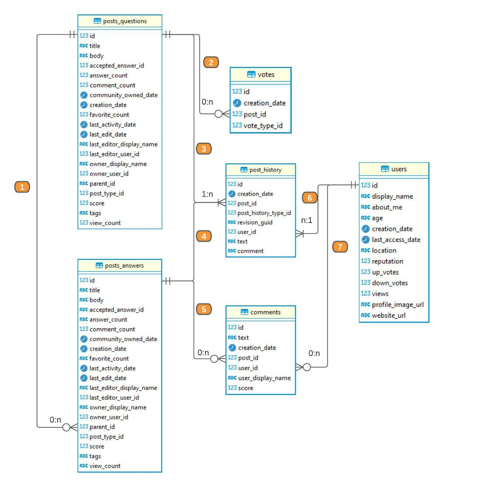

# Chapter 1: Understanding the Database
In this chapter we're going to get into the details of the project that we'll be developing throughout the book. As you saw in the introduction, we're using a real-world, public dataset from StackOverflow.

Before we dive into writing queries you should make sure you have the proper development environment set up. I will not list the instructions here in case things change so I'll add them to the GitHub repo. Make sure you visit: https://github.com/ergest/sql_patterns for the most up to date instructions.

StackOverflow is a popular website where users post questions about technical topics such as programming languages, databases, etc. and other user can post answers, comment and vote on them.

Based on the quality of the answers, users gain reputation and badges which act as social proof both on StackOverflow and on other websites.

Using this dataset we're going to build a table that calculates reputation metrics for every user. This type of table is sometimes called a "feature table" and can be used in other applications in data science and analytics. You simply replace the `user_id` with a `customer_id` or another entity.

Since the query to build it is complex, it's the perfect tool to illustrate the patterns described in this book.

The schema of that table would look something like this:
```sql
| column_name               | type    |
|---------------------------|---------|
| user_id                   | INT64   |
| user_name                 | STRING  |
| total_posts_created       | NUMERIC |
| total_answers_created     | NUMERIC |
| total_answers_edited      | NUMERIC |
| total_questions_created   | NUMERIC |
| total_upvotes             | NUMERIC |
| total_comments_by_user    | NUMERIC |
| total_questions_edited    | NUMERIC |
| streak_in_days            | NUMERIC |
| total_comments_on_post    | NUMERIC |
| posts_per_day             | NUMERIC |
| edits_per_day             | NUMERIC |
| answers_per_day           | NUMERIC |
| questions_per_day         | NUMERIC |
| comments_by_user_per_day  | NUMERIC |
| answers_per_post          | NUMERIC |
| questions_per_post        | NUMERIC |
| upvotes_per_post          | NUMERIC |
| downvotes_per_post        | NUMERIC |
| user_comments_per_post    | NUMERIC |
| comments_on_post_per_post | NUMERIC |
```

## Understanding the source Data Model
Writing accurate and efficient SQL begins with understanding the source data model you're working with. There may already exist documentation and diagrams explaining it but more often than not you'll have to learn as you go.

The original StackOverflow (SO) data model is different from the one provided in my repo. That's because I pulled it from BigQuery where the engineers modified the original model somewhat. For example the SO model contains a single `Posts` table for all the different types of post types whereas BigQuery split each one into a separate table.


**Figure 1.1 - StackOverflow ER diagram**

There are 8 tables that represent the various post types. You can get this result by using the `information_schema` views in DuckDB like this:
```sql
--listing 1.1
SELECT table_name
FROM information_schema.tables
WHERE table_name like 'posts_%';
```
Assuming you've set things up properly here's the results from DBeaver (in text output mode) I'll only use this format henceforth so your output might be different in the GUI.
```
table_name     |
---------------+
posts_answers  |
posts_questions|
```

We'll be focusing on just these two for our project:
 1. `posts_questions` contains all the question posts
 2. `posts_answers` contains all the answer posts

They both have the same schema:
```sql
--listing 1.2
SELECT column_name, data_type
FROM information_schema.columns
WHERE table_name = 'posts_answers';
```
Here's the result of the query
```sql
column_name             |data_type|
------------------------+---------+
id                      |BIGINT   |
title                   |VARCHAR  |
body                    |VARCHAR  |
accepted_answer_id      |VARCHAR  |
answer_count            |VARCHAR  |
comment_count           |BIGINT   |
community_owned_date    |TIMESTAMP|
creation_date           |TIMESTAMP|
favorite_count          |VARCHAR  |
last_activity_date      |TIMESTAMP|
last_edit_date          |TIMESTAMP|
last_editor_display_name|VARCHAR  |
last_editor_user_id     |BIGINT   |
owner_display_name      |VARCHAR  |
owner_user_id           |BIGINT   |
parent_id               |BIGINT   |
post_type_id            |BIGINT   |
score                   |BIGINT   |
tags                    |VARCHAR  |
view_count              |VARCHAR  |
```

Both tables have an `id` column that identifies a single post, a `creation_date` column that identifies the timestamp when the post was created and a few other attributes like `score, answer_count` and `comment_count`.

Note the `parent_id` column which signifies a hierarchical structure. The `parent_id` is a one-to-many relationship that links up an answer to the corresponding question. A single question can have multiple answers but an answer belongs to one and only one question. This is relation 1 in the **Figure 1.1** above.

Both post types (question and answer) have a one-to-many relationship to the `post_history`. These are relations 3 and 4 in the diagram above.

```sql
--listing 1.3
SELECT column_name, data_type
FROM information_schema.columns
WHERE table_name = 'post_history';
```
Here's the result of the query
```sql
column_name         |data_type|
--------------------+---------+
id                  |BIGINT   |
creation_date       |TIMESTAMP|
post_id             |BIGINT   |
post_history_type_id|BIGINT   |
revision_guid       |VARCHAR  |
user_id             |BIGINT   |
text                |VARCHAR  |
comment             |VARCHAR  |
```

A single post can have many types of activities identified by the `post_history_type_id` column. This id indicates the different types of activities a user can perform on the site. We're only concerned with the first 6. You can see the rest of them [here](https://meta.stackexchange.com/questions/2677/database-schema-documentation-for-the-public-data-dump-and-sede/2678#2678) if you're curious.

1. Initial Title - initial title _(questions only)_
2. Initial Body - initial post _(raw body text)_
3. Initial Tags - initial list of tags _(questions only)_ 
4. Edit Title - modified title _(questions only)_
5. Edit Body - modified post body _(raw markdown)_
6. Edit Tags - modified list of tags _(questions only)_

The first 3 indicate when a post is first submitted and the next 3 when a post is edited.

The `post_history` table also connects to the `users` table via the `user_id` in a one-to-many relationship shown in Figure 1.1 as number 6.  A single user can perform multiple activities on a post.

In database lingo this is known as a bridge table because it connects two tables (user and posts) that have a many-to-many relationship which cannot be modeled otherwise.

The `users` table has one row per user and contains user attributes such as name, reputation, etc. We'll use some of these attributes in our final table.

```sql
--listing 1.4
SELECT column_name, data_type
FROM information_schema.columns
WHERE table_name = 'users';
```
Here's the result of the query
```sql
column_name      |data_type|
-----------------+---------+
id               |BIGINT   |
display_name     |VARCHAR  |
about_me         |VARCHAR  |
age              |VARCHAR  |
creation_date    |TIMESTAMP|
last_access_date |TIMESTAMP|
location         |VARCHAR  |
reputation       |BIGINT   |
up_votes         |BIGINT   |
down_votes       |BIGINT   |
views            |BIGINT   |
profile_image_url|VARCHAR  |
website_url      |VARCHAR  |
```

Next we take a look at the `comments` table. It has a zero-to-many relationship with posts and with users shown in the diagram as number 5 and number 7, since both a user or a post could have 0 or many comments.
```sql
--listing 1.5
SELECT column_name, data_type
FROM information_schema.columns
WHERE table_name = 'comments';
```
Here's the result of the query
```sql
column_name      |data_type|
-----------------+---------+
id               |BIGINT   |
text             |VARCHAR  |
creation_date    |TIMESTAMP|
post_id          |BIGINT   |
user_id          |BIGINT   |
user_display_name|VARCHAR  |
score            |BIGINT   |
```

Finally the `votes` table represents the upvotes and downvotes on a post. We'll need this to compute the total vote count on a user's post which will indicate how good the question or the answer is. This table has a granularity of one row per vote per post per date.
```sql
--listing 1.6
SELECT column_name, data_type
FROM information_schema.columns
WHERE table_name = 'votes';
```
Here's the result of the query
```sql
column_name  |data_type|
-------------+---------+
id           |BIGINT   |
creation_date|TIMESTAMP|
post_id      |BIGINT   |
vote_type_id |BIGINT   |
```

The `votes` table is connected to a post in a one-to-many relationship shown in Fig 1.1 as number 2. In order for us to get upvotes and downvotes on a user's post, we'll need to join it with the `users` table.

Alright, now that we've familiarized ourselves with the source data model, next let's look at some core concepts.